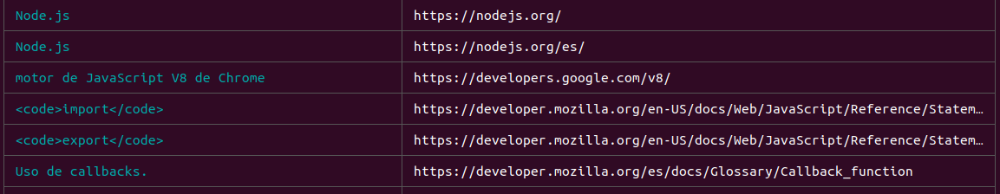
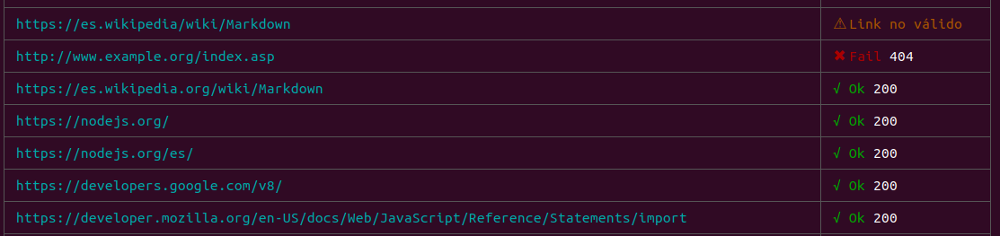
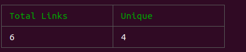
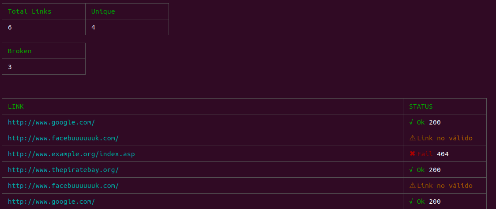
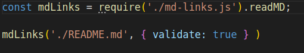
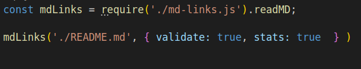
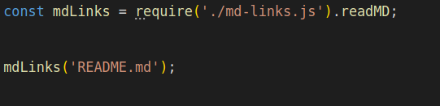

# Markdown Links Hunter

Markdown Links Hunter es una librería que ayuda a los desarrolladores a analizar los enlaces existentes en un archivo con extensión ".md". La libreria incluye tanto una CLI para su uso en la terminal como una API que puedes utilizar desde cualquier archivo Javascript presente en la carpeta de tu proyecto.

## 1. Instalación

Para instalar Markdown Links Hunter debes ejecutar el siguiente comando en la terminal:

`npm install markdown-links-hunter`

Luego, debes importar el módulo principal en el archivo javascript correspondiente:

`const mdLinks = require('markdown-links-hunter')`

## 2. Uso

### 2.1. CLI

`node <archivo.js> <ruta-de-archivo-md>`

De forma predeterminada, Markdown Links Hunter recibe un único archivo .md, el cual analiza en busca de enlaces a sitios web externos. El resultado consiste en una lista de URLs y el texto asociado a cada uno:

`node md-links-hunter.js <ruta-de-archivo-md> --validate` o `-v`

Al espeficar este flag, Markdown Links Hunter realizará tanto el análisis básico como la validación de las URLs para conocer su código de estado (Ok 200, Fail 404, Warning para URLs no válidas) y mostrará la información de la siguiente manera:

`node md-links-hunter.js <ruta-de-archivo-md> --stats` o `-s`

Al espeficar este flag, Markdown Links Hunter realizará el análisis básico y entregará información estadística sobre las URLs existentes en el archivo .md. El resultado se verá de la siguiente manera:

`node md-links-hunter.js <ruta-de-archivo-md> --validate --stats` o `-v -s`

Al espeficar ambos flags, Markdown Links Hunter realizará el análisis básico, validará las URLs y mostrará información estadística sobre ellas. El resultado se verá de la siguiente manera:

### 2.3 API de Javascript

Para utilizar la API de Markdown Links Hunter debes importar el módulo principal copiando y pegando la siguiente línea en el archivo javascript en el que quieras utilizarlo:

`const mdLinks = require('markdown-links-hunter')`

Luego, podrás utilizar el módulo de esta forma:

`mdLinks(<ruta-de-archivo-md>, *<opciones>)`

`<opciones>` equivale a un objeto, el que puede contener las siguientes propiedades:

 * Solo validación:

 

 * Solo estadísticas:

 

 * Tanto validación como estadísticas:

 

 Para ejecutar un análisis básico, especifica únicamente la ruta

 * 

## 3. Librerias utilizadas en el proyecto

* [MarkdownIt](https://github.com/markdown-it/markdown-it)
* [JSDOM](https://github.com/jsdom/jsdom)
* [Node-Fetch](https://www.npmjs.com/package/node-fetch)
* [Cli-Table](https://www.npmjs.com/package/cli-table)
* [Colors](https://www.npmjs.com/package/colors)
* [P-Queue](https://github.com/sindresorhus/p-queue)

## Desarrollado por:

* [Génesis Astete](https://github.com/GenesisAstete)
* [Loreto Gutiérrez](https://github.com/LoretoGutierrezH/)